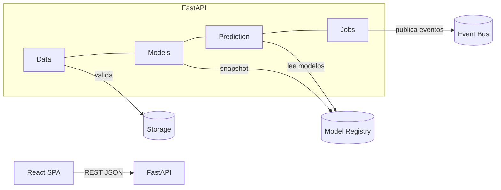
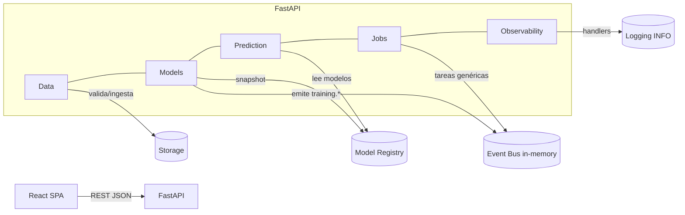
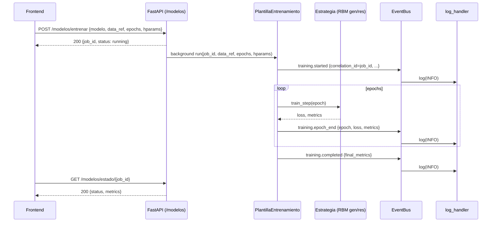
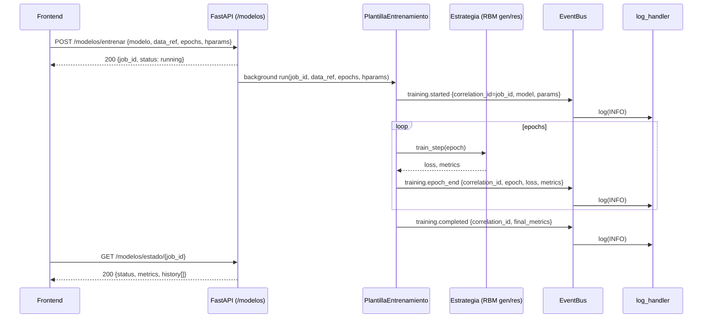
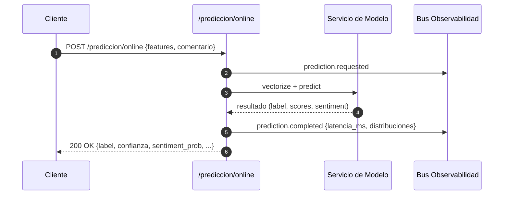
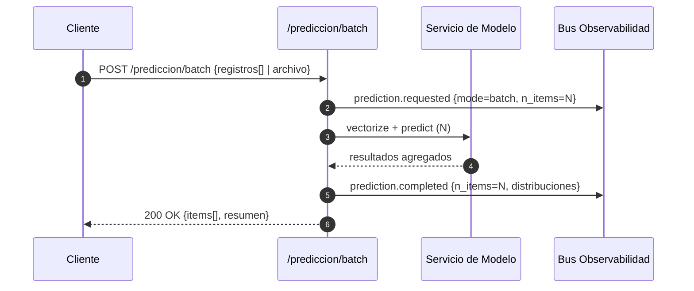
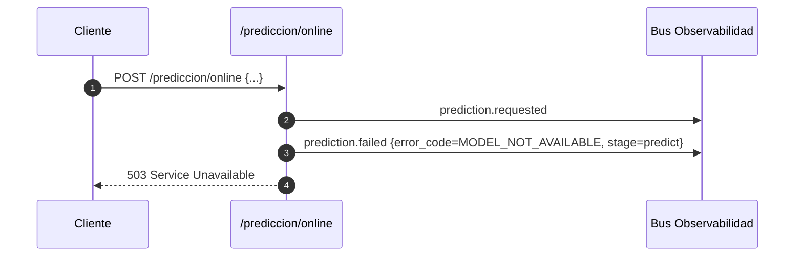

# Apéndice A — Arquitectura (Día 2, referencia histórica)

# Arquitectura — NeuroCampus (Día 2)
<!--
Objetivo del día 2:
- Ampliar la arquitectura con los esquemas de datos y la capa de ingesta.
- Documentar el flujo de datos y aclarar el tratamiento de los comentarios cualitativos.
-->

## 1. Visión general
- **Dominio**: análisis educativo (datasets, modelos, predicción, jobs).
- **Estilo**: servicios modulares (FastAPI) + SPA (React/Vite).
- **Tronco común**: contratos HTTP con JSON (+ TypeScript types para FE).

## 2. Capas y módulos
- **Data** (ingesta/validación): adapters a almacenamiento, validaciones, esquemas JSON.
- **Models** (entrenamiento/publicación): ciclo de vida del modelo.
- **Prediction** (online/batch): entradas limpias → salidas con postproceso.
- **Jobs** (orquestación/estado): seguimiento de tareas asíncronas.

## 3. Patrones (acordados)
- **Strategy**, **Template Method**, **Facade**, **Chain of Responsibility**, **Observer**, **Command**, **Adapter**.
<!-- Nota: se detallarán con ejemplos en días 2–6. -->

## 4. Diagramas (borradores)
### 4.1 Componentes (mermaid)


---

## 5. Ingesta sin SQL (Día 2)
- La UI (DataUpload) consulta **GET /datos/esquema** para construir el formulario dinámico.
- **POST /datos/upload** (mock) valida formato mínimo y devuelve `dataset_id` y `rows_ingested` (placeholder).
- Persistencia: **no SQL** por ahora; se utiliza almacenamiento de archivos (CSV/XLSX/Parquet).
- Los esquemas están definidos en `schemas/plantilla_dataset.schema.json` y `schemas/features.quantitativas.json`.

### 5.1 Procesamiento de comentarios (PLN)
- Los campos `comentario.sent_pos`, `comentario.sent_neg` y `comentario.sent_neu` **no forman parte del dataset original**.
- El sistema genera estos valores automáticamente durante la **etapa de Procesamiento de Lenguaje Natural (PLN)**, prevista para el **Día 6**.
- Su cálculo se basa en el texto contenido en la columna `Sugerencias:` de cada registro.
- Los resultados se almacenan como atributos adicionales del dataset procesado y no son requeridos en la validación de `POST /datos/upload`.
- De esta manera se mantiene la separación de responsabilidades:
  - Día 2 → Ingesta y validación del esquema base (sin sentimientos).
  - Día 6 → Análisis de sentimientos y enriquecimiento de los datos.

---

## 6. Próximos pasos
- Día 3: agregar `/datos/validar` con reglas dinámicas.
- Día 4: conectar Jobs y Modelos.
- Día 5: flujo de predicción en frontend.
- Día 6: incorporar análisis de sentimientos (PLN).

# Arquitectura — NeuroCampus (v0.4.0 con Apéndice Día 2)

Primero la arquitectura **v0.4.0 (vigente)** y al final un **Apéndice** con la versión **Día 2** completa, sin cambios.

---

# Arquitectura — NeuroCampus (v0.4.0, Día 4)

<!--
Objetivo del Día 4:
- Establecer la plantilla de entrenamiento (Template Method) y estrategias de modelo (RBM general/restringida).
- Conectar eventos de observabilidad `training.*` al flujo de entrenamiento.
- Alinear contratos de API con `/modelos/entrenar` y `/modelos/estado/{job_id}`.
-->

## 1. Visión general
- **Dominio**: análisis educativo (datasets, modelos, predicción, jobs).
- **Estilo**: servicios modulares (FastAPI) + SPA (React/Vite).
- **Tronco común**: contratos HTTP con JSON (+ TypeScript types para FE).
- **Observabilidad (nuevo D4)**: bus de eventos **in-memory** (pub/sub) que emite `training.*` durante el entrenamiento; destino por defecto a **logging**.

## 2. Capas y módulos
- **Data** (ingesta/validación): adapters a almacenamiento, validaciones, esquemas JSON.
- **Models** (entrenamiento/publicación): **Plantilla de entrenamiento** + **Estrategias** (RBM general/restringida). Emite `training.*`.
- **Prediction** (online/batch): entradas limpias → salidas con postproceso.
- **Jobs** (orquestación/estado): seguimiento de tareas **genéricas**. *Para entrenamientos, el estado visible vive en `/modelos/estado/{job_id}` en v0.4.0.*
- **Observability** (nuevo): bus de eventos y destinos (p. ej. `log_handler`).

## 3. Patrones (acordados)
- **Template Method** (orquestación de entrenamiento).
- **Strategy** (RBM general vs RBM restringida).
- **Observer** (eventos `training.*` a través del bus).
- **Facade**, **Chain of Responsibility**, **Command**, **Adapter**.

## 4. Diagramas (actualizados D4)

### 4.1 Componentes (mermaid)


### 4.2 Secuencia — Entrenamiento RBM con observabilidad


## 5. Ingesta sin SQL (Día 2) — **se mantiene**
- La UI (DataUpload) consulta **GET /datos/esquema** para construir el formulario dinámico.
- **POST /datos/upload** valida formato mínimo y devuelve `dataset_id` y `rows_ingested` (placeholder).
- Persistencia: **no SQL** por ahora; se utiliza almacenamiento de archivos (CSV/XLSX/Parquet).
- Esquemas en `schemas/plantilla_dataset.schema.json` y `schemas/features.quantitativas.json`.

### 5.1 Procesamiento de comentarios (PLN)
- Los campos de sentimiento no forman parte del dataset original; se calculan en **Día 6** con PLN a partir de `Sugerencias:` y se añaden como enriquecimiento.

## 6. Observabilidad de entrenamiento (nuevo D4)
- **EventBus in-memory** (pub/sub) publica eventos:
  - `training.started` → `{ correlation_id, model, params }`
  - `training.epoch_end` → `{ correlation_id, epoch, loss, metrics }`
  - `training.completed` → `{ correlation_id, final_metrics }`
  - `training.failed` → `{ correlation_id, error }`
- **Destinos**: `log_handler` (INFO). El bus es intercambiable por Kafka/Rabbit en producción.
- **Resiliencia**: los handlers no interrumpen el entrenamiento si fallan (best-effort).
- **Correlación**: `correlation_id == job_id` para seguimiento en logs/UI.

## 7. API y contratos relevantes (v0.4.0)
- **POST `/modelos/entrenar`**: lanza entrenamiento en background con una estrategia RBM (general o restringida).
- **GET `/modelos/estado/{job_id}`**: expone estado y últimas métricas.
- **/jobs**: permanece para **tareas genéricas** (sin cambios vs v0.3.0). Para entrenamientos, el FE consulta `/modelos/estado`.
- Ver detalle en `docs/api.md` (v0.4.0).

## 8. Decisiones y no-funcionales
- **Simplicidad de despliegue**: EventBus in-memory y destino logging por defecto.
- **Intercambiabilidad**: la plantilla no conoce los detalles de RBM (Strategy).
- **Privacidad**: eventos no incluyen datos sensibles ni muestras; solo metadatos/estadísticas.
- **Extensibilidad**: añadir más destinos (p. ej. métricas en Prometheus, colas externas) sin tocar el template.

## 9. Integración Frontend (guía breve)
- **Lanzar**: usar `POST /modelos/entrenar` (apiClient), capturar `job_id`.
- **Progreso**: `GET /modelos/estado/{job_id}` con *polling* (p. ej., 1–2 s) hasta `completed|failed`.
- **UI**: mostrar curva de `loss/recon_error` por epoch (Día 4 B) y estado del job.
- **Errores**: si `failed`, presentar `error` con opción de reintento.

## 10. Próximos pasos
- **Día 5**: flujo de **Predicción** en frontend (inputs → `/prediction`).
- **Día 6**: incorporar **PLN** (sentimientos) y enriquecer dataset/visualizaciones.
- **Día 6–7**: evaluar sinks de observabilidad (Prometheus/Grafana, Kafka) y dashboard de Jobs.

## Anexo — Cambios acumulados Día 4 (v0.4.0)
> Fecha de actualización: 2025-10-10 14:15:36

Este anexo se agrega **al final** del documento existente y detalla los cambios
introducidos el **Día 4** para alinear Arquitectura con la implementación actual
(Plantilla de Entrenamiento + Estrategias RBM + Observabilidad `training.*`).

## 1) Objetivos y alcance (Día 4)
- **Objetivo**: Establecer la **PlantillaEntrenamiento** (Template Method) y las **Estrategias** de modelo (RBM general/restringida), conectadas a un **EventBus in-memory** que publica eventos `training.*` durante el ciclo de entrenamiento.
- **Listo cuando**: El **flujo de entrenamiento** y las **métricas/eventos** están documentados y conectados con los **contratos de API** expuestos por `/modelos`.

## 2) Componentes introducidos/actualizados
- **Models**
  - `PlantillaEntrenamiento`: orquesta `epochs`, recibe una `EstrategiaEntrenamiento` y emite eventos.
  - `RBMGeneral` / `RBMRestringida`: implementan `setup()` y `train_step()` (CD-k).
- **Observability**
  - `EventBus` (pub/sub in-memory) y `log_handler` (sink por defecto).
  - Eventos: `training.started`, `training.epoch_end`, `training.completed`, `training.failed`.
- **API / Routers**
  - `/modelos/entrenar` (POST) lanza el job y devuelve `job_id`.
  - `/modelos/estado/{job_id}` (GET) consolida `status`, `metrics` y `history[]` desde eventos.
- **Frontend**
  - Vista **Models**: lanza entrenamiento y grafica curva `recon_error` por época.

## 3) Patrones (Día 4)
- **Template Method**: `PlantillaEntrenamiento.run()` controla el ciclo y emite eventos.
- **Strategy**: `RBMGeneral` / `RBMRestringida` encapsulan el algoritmo (RBM con CD-k).
- **Observer**: `EventBus` suscribe handlers (logging) sin acoplarse a la plantilla.
- **Adapter / Facade**: Routers para simplificar el acceso desde FE.

## 4) Diagramas (Mermaid)

### 4.1 Componentes (actualizado D4)


### 4.2 Secuencia — Entrenamiento RBM + eventos


## 5) Contratos relevantes y trazabilidad
- **POST `/modelos/entrenar`**: inicia job y conecta `correlation_id == job_id` para eventos.
- **GET `/modelos/estado/{job_id}`**: agrega `history[]` (un punto por `epoch_end`) y snapshot de `metrics` (o `final_metrics`).
- **Hparams**: normalizados a *minúsculas* en el router para robustez.
- Ver detalle de campos/ejemplos en **docs/api.md (v0.4.0)**.

## 6) Decisiones no‑funcionales (D4)
- **Simplicidad**: EventBus in-memory y logging como sink por defecto.
- **Resiliencia**: un handler fallido no detiene el entrenamiento (best‑effort).
- **Privacidad**: eventos no cargan datos sensibles; solo metadatos y métricas.
- **Extensibilidad**: futuros sinks (Prometheus/Grafana, Kafka/Rabbit) y más estrategias de modelo sin cambiar la plantilla.

## 7) Integración Frontend
- Lanza entrenamiento → `POST /modelos/entrenar` → recibe `job_id`.
- Polling → `GET /modelos/estado/{job_id}` cada 1–2 s hasta `completed|failed`.
- UI muestra: `status`, `job_id`, curva `recon_error`/`loss`, y errores si los hay.

## 8) Compatibilidad
- Se conserva el diseño de **Día 2–3** (ingesta y validación) sin cambios de ruptura.
- `/jobs` sigue disponible para tareas genéricas; el estado de entrenamiento se consulta en `/modelos/estado`.


---

# Anexo — Cambios Día 5 (A): Unificación de Datos Históricos
> Fecha de actualización: 2025-10-12  | Versión v0.5.0-data-A

## 1) Objetivos y alcance
- **Objetivo:** Consolidar y normalizar los datasets históricos en un único recurso unificado que sirva como fuente de verdad para las metodologías de entrenamiento (PeriodoActual / Acumulado / Ventana).  
- **Listo cuando:**  
  - Existe el archivo `/historico/unificado.parquet` generado correctamente.  
  - Las rutas de almacenamiento y lectura están documentadas en esta arquitectura.  
  - Los modelos y metodologías pueden acceder al recurso unificado sin duplicar lógica.

## 2) Componentes nuevos / actualizados

| Componente | Ubicación | Descripción |
|:------------|:-----------|:------------|
| **UnificacionStrategy** | `backend/src/neurocampus/data/strategies/unificacion.py` | Concatena, normaliza y deduplica datasets por período; genera archivos `.parquet` en `/historico`. |
| **Adapters de datos** | `data/adapters/{almacen,dataframe,formato}_adapter.py` | Capa de abstracción para almacenamiento (LocalFS / S3-like) y lectura multi-formato (CSV/XLSX/Parquet). |
| **Scripts** | `scripts/test_unificacion_quick.py` | Prueba rápida de unificación para verificar estructura y generación de `unificado.parquet`. |
| **Documentación** | `docs/arquitectura.md` (este archivo) | Se añaden rutas y flujo de unificación de datasets. |

## 3) Rutas y recursos de almacenamiento

```
storage/
 ├── datasets/
 │   ├── 2024-1/
 │   │   └── data.csv
 │   ├── 2024-2/
 │   │   └── data.csv
 │   └── 2025-1/
 │       └── data.xlsx
 └── historico/
     ├── unificado.parquet                ← recurso consolidado
     ├── periodo_actual/
     │   └── 2025-1.parquet              ← último período
     └── ventanas/
         └── unificado_2024-1_2025-1.parquet
```

## 4) Flujo de unificación (Día 5 — A)

```mermaid
flowchart TD
    subgraph DataLayer [Capa Data]
      A[Adapters almacen/formato/dataframe] --> B[UnificacionStrategy]
    end
    B --> C[(storage/datasets/{AAAA-SEM})]
    B --> D[(storage/historico/*.parquet)]
    D -->|lee| M[Models / Metodologías]
```

### Secuencia simplificada
1. `UnificacionStrategy.listar_periodos()` → detecta subcarpetas `datasets/{AAAA-SEM}`.  
2. Por cada período lee el archivo (`.parquet > .csv > .xlsx`) con `read_file()`.  
3. Normaliza encabezados (vía `normalizar_encabezados`) y añade columna `periodo`.  
4. Concatena todos los periodos (`acumulado()`), elimina duplicados (`_dedupe_concat`).  
5. Guarda `historico/unificado.parquet`.  
6. Otras modalidades:  
   - **`periodo_actual()`** → solo último período.  
   - **`ventana()`** → rango o N últimos periodos.

## 5) Interfaces y consumo por metodologías
- Las metodologías de entrenamiento (Día 5 — B) usan estas rutas:  
  - **PeriodoActual:** `storage/historico/periodo_actual/<AAAA-SEM>.parquet`  
  - **Acumulado:** `storage/historico/unificado.parquet`  
  - **Ventana:** `storage/historico/ventanas/unificado_<desde>_<hasta>.parquet`  
- `modelos_facade.py` y `metodologia.py` detectan estas rutas y cargan directamente el DataFrame con el adapter correspondiente.  

## 6) Eventos y observabilidad
- Durante la unificación se emiten eventos `data.unification.*` (opcional, si hay EventBus).  
- Payload típico:  
  ```json
  {
    "rows": 1234,
    "duplicates_dropped": 45,
    "elapsed_ms": 812,
    "path": "storage/historico/unificado.parquet"
  }
  ```
- Permite monitorear el proceso en logs y dashboards de Jobs.

## 7) Ejemplo de uso desde scripts
```bash
# Ejecutar unificación completa
python backend/src/neurocampus/data/strategies/unificacion.py

# ó con el comando registrado en Jobs
python backend/src/neurocampus/jobs/commands/cmd_unificar_historico.py
```

## 8) Prueba rápida local (Día 5)
```bash
python scripts/test_unificacion_quick.py
```
Salida esperada:
```
[OK] generado: historico/unificado.parquet { periodos: 3, rows: N }
```

## 9) Patrones utilizados
- **Strategy:** `UnificacionStrategy` para métodos PeriodoActual/Acumulado/Ventana.  
- **Adapter:** almacenamiento y formatos abstractos.  
- **Facade:** `datos_facade.py` expone una API simple para modelos y jobs.  
- **Command:** script de jobs para automatizar unificación.  

## 10) Compatibilidad y siguientes pasos
- No rompe contratos existentes; solo añade fuentes de datos para entrenamiento.  
- Día 5 — B usará estas rutas para las estrategias de metodología.  
- Día 6 añadirá enriquecimiento (PLN) a los datasets históricos.  
- Día 7 automatizará la ejecución como Job (`cmd_unificar_historico`).  

---

# Apéndice — Observabilidad de Predicción `prediction.*` (v0.5.0 draft)

> **Estado:** Borrador aprobado por **Miembro A** en *Día 6* para implementación por **Miembro B**.  
> **Alcance:** Define **catálogo de eventos**, **esquemas** y **buenas prácticas** para el ciclo de **predicción**.  
> **Compatibilidad:** Amplía la familia de eventos existentes (p. ej., `training.*`); no rompe integraciones.

---

## 1. Principios de diseño

- **Inmutabilidad del evento:** los eventos no se editan; cualquier corrección se emite como un nuevo evento.  
- **Idempotencia por `correlation_id`:** todos los eventos de un mismo request/lote comparten el mismo `correlation_id` (UUID v4).  
- **Privacidad por diseño:** no incluir PII (p. ej., nombres, e‑mails, IP). Solo metadatos técnicos y agregaciones.  
- **Compatibilidad hacia adelante:** se permite añadir campos **opcionales** sin romper consumidores.  
- **Trazabilidad extremo a extremo:** cada solicitud de predicción debe producir al menos `prediction.requested` y uno de `prediction.completed` o `prediction.failed`.

---

## 2. Catálogo de eventos

### 2.1 `prediction.requested`
Emitido **al recibir** una solicitud de predicción (modo `online` o `batch`).

**Payload (JSON):**
```json
{
  "correlation_id": "uuid-...-req",
  "family": "sentiment_desempeno",
  "mode": "online",
  "n_items": 1,
  "ts": "2025-10-12T16:30:00Z"
}
```

**Campos:**
- `correlation_id` *(string, UUID, requerido)* — Identificador único compartido a lo largo del ciclo.  
- `family` *(string, requerido)* — Familia/ensamble a usar (p. ej., `sentiment_desempeno`).  
- `mode` *(string, requerido)* — `"online"` | `"batch"`.  
- `n_items` *(int, requerido)* — Número de registros a predecir (1 en online).  
- `ts` *(string, ISO‑8601, opcional pero recomendado)* — Timestamp de emisión (UTC).


### 2.2 `prediction.completed`
Emitido **al responder con éxito** una solicitud de predicción.

**Payload (JSON):**
```json
{
  "correlation_id": "uuid-...-req",
  "latencia_ms": 18,
  "n_items": 1,
  "distribucion_labels": { "Álgebra": 1 },
  "distribucion_sentiment": { "pos": 0.66, "neu": 0.24, "neg": 0.10 },
  "ts": "2025-10-12T16:30:00Z"
}
```

**Campos:**
- `correlation_id` *(string, requerido)* — Debe coincidir con `prediction.requested`.  
- `latencia_ms` *(int, requerido)* — Latencia total (servidor) del request/lote.  
- `n_items` *(int, requerido)* — Número de registros efectivamente procesados.  
- `distribucion_labels` *(objeto, opcional)* — Conteo por etiqueta predicha en el lote.  
- `distribucion_sentiment` *(objeto, opcional)* — Promedios o agregados `{pos, neu, neg}`.  
- `ts` *(string, ISO‑8601, opcional)* — Timestamp de emisión (UTC).


### 2.3 `prediction.failed`
Emitido ante **error** en cualquier etapa del proceso.

**Payload (JSON):**
```json
{
  "correlation_id": "uuid-...-req",
  "error_code": "MODEL_NOT_AVAILABLE",
  "error": "No hay campeón publicado para la familia solicitada",
  "stage": "predict",
  "ts": "2025-10-12T16:30:02Z"
}
```

**Campos:**
- `correlation_id` *(string, requerido)* — El mismo del ciclo.  
- `error_code` *(string, requerido)* — Código canónico (ver tabla).  
- `error` *(string, requerido)* — Mensaje resumen legible.  
- `stage` *(string, opcional)* — `"vectorize" | "predict" | "postprocess" | "io"`.  
- `ts` *(string, ISO‑8601, opcional)* — Timestamp de emisión (UTC).

**Códigos canónicos sugeridos:**
- `INVALID_PAYLOAD`, `UNSUPPORTED_MEDIA_TYPE`, `UNPROCESSABLE_ENTITY`  
- `MODEL_NOT_AVAILABLE`, `MODEL_LOAD_FAILED`, `MODEL_TIMEOUT`  
- `VECTORIZE_ERROR`, `POSTPROCESS_ERROR`  
- `IO_ERROR`, `INTERNAL_ERROR`

---

## 3. Contrato del sobre (envelope)

Todos los eventos se publican en el bus con:  
- **`event`** *(string)* — nombre (`prediction.requested|completed|failed`)  
- **`payload`** *(object)* — JSON conforme a los esquemas anteriores

Ejemplo de publicación (pseudocódigo Python):
```python
publicador(event="prediction.completed", payload={
    "correlation_id": "...",
    "latencia_ms": 18,
    "n_items": 1
})
```
> Nota: si se dispone del helper `eventos_prediccion.py`, usar `emit_requested|emit_completed|emit_failed` para estandarizar nombres y shape.

---

## 4. Métricas derivadas sugeridas

- **`prediction_requests_total`** *(counter)* — +1 por `prediction.requested` (labels: `mode`, `family`).  
- **`prediction_completed_total`** *(counter)* — +1 por `prediction.completed` (labels: `mode`, `family`).  
- **`prediction_failed_total`** *(counter)* — +1 por `prediction.failed` (labels: `stage`, `error_code`).  
- **`prediction_latency_ms`** *(histogram)* — observado con `latencia_ms` (labels: `mode`, `family`).  
- **`prediction_label_distribution`** *(gauge)* — derivada de `distribucion_labels` por ventana.  
- **`prediction_sentiment_avg`** *(gauge)* — `{pos, neu, neg}` promediados por ventana.

---

## 5. Ejemplos de flujo

### 5.1 Online (1 registro)


### 5.2 Batch (N registros)


### 5.3 Error (modelo no disponible)


---

## 6. Buenas prácticas de implementación

- **Generación de `correlation_id`:** si el cliente no lo provee, generarlo al recibir la solicitud. Propagarlo a logs.  
- **Tiempos:** medir `latencia_ms` del ciclo completo en servidor (excluye red del cliente).  
- **Batch:** llenar `distribucion_labels` con conteos y `distribucion_sentiment` con promedios por lote.  
- **Errores:** usar `error_code` estable y documentado; mensajes cortos, sin PII.  
- **Logs:** el `log_handler` debe registrar toda publicación; no duplicar PII en logs.  
- **Backpressure:** si el bus está caído, **no** bloquear respuesta al cliente; degradar con logs locales y alerta.

---

## 7. Control de cambios

- **v0.5.0 (draft)** — Definición inicial de `prediction.requested|completed|failed`, contratos de payload y guías de métricas.  
- **v0.6.0 (planned)** — Ajustes menores tras implementación de Miembro B (campos concretos adicionales, sampling).

